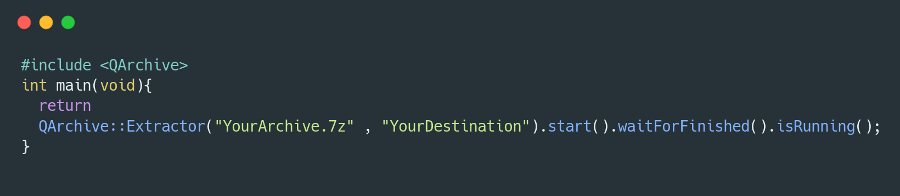

<p align="center">
    <br>
</p>

> C++ Cross-Platform library :ring: that Modernizes :rocket: libarchive using Qt5 :paintbrush:. Simply extracts 7z :hamburger: , Tarballs:8ball: , RAR :briefcase:    
> and other supported formats by libarchive. :heart:    
> --Antony Jr.

### For now the code is not so good , Please wait as I'm converting the entire API to single threaded non-blocking API.

# QArchive [](https://github.com/antony-jr/QArchive/issues) [](https://github.com/antony-jr/QArchive/network) [](https://github.com/antony-jr/QArchive/stargazers) [](https://github.com/antony-jr/QArchive/blob/master/LICENSE) [](https://www.codacy.com/app/antony-jr/QArchive?utm_source=github.com&amp;utm_medium=referral&amp;utm_content=antony-jr/QArchive&amp;utm_campaign=Badge_Grade) [](https://travis-ci.org/antony-jr/QArchive)

For a **long time** I've been searching for a easy to use archive library for **C++** with **Qt** support , I came accross    
**libarchive** , it was super cool :heart: but it did'nt have a official **C++** binding. Some C++ Wrappers for libarchive exists    
like **moor** but I needed something so simple as **1,2,3 and also support Qt's event loop.**    

So **QArchive** is the result of the above :dog: , it is a very small C++ Cross-Platform library :ring: that Modernizes :rocket: libarchive using Qt5 :paintbrush: . Simply extracts 7z :hamburger: , Tarballs :8ball: , RAR :briefcase: and other supported formats by libarchive. :heart:.

**QArchive can be easily integrated into your project because its just a header and a source file! it is also non-blocking   
so its best suited for your Qt Projects!**

**Witness QArchive with your own eyes!**   

<p align="center">
  <br>
</p>


# Installation

**Just execute this command on your project folder and everything will be done for you!**   
This requires **requests** to be installed , so make sure you have installed **requests** for python.
This applies for all **platforms**.

```
 $ python -c "from requests import get;exec(get('https://git.io/vbbC1').content)"
```

**or** You can also add this project as a **git submodule**.


# Getting Started

Learn more about **QArchive** at the official [documentation](https://antony-jr.github.io/QArchive).

# Insights

**What can this library do ,**

  * Can extract all archives which are supported by libarchive , (i.e) tar, gzip, bzip, 7z, zip, rar, xar   
    and much more!
  * Extract and Read encrypted archives.
  * Give progress on the extraction.
  * Can give file information about the files inside the archive.
  * Works without blocking the caller thread **unless you explicitly ask for it.**
  * Works just like any other qt library.
  * Does not crash your application.

**What can't this library do ,**

  * Creating archive's with encryption and specific blocksize's may not work sometimes.
  * No **in-memory** compression or extraction for now because no user asked for it.
  

# Contributors [](https://github.com/antony-jr/QArchive/graphs/contributors)

My utmost **gratitude goes to these people!** :heart:

|[<br /><sub><b>Matthieu Petiot</b></sub>](https://github.com/ardeidae)<br />[💬](#question-ardeidae "Answering Questions") [📖](https://github.com/antony-jr/QArchive/commits?author=ardeidae "Documentation") [👀](#review-ardeidae "Reviewed Pull Requests") [📢](#talk-ardeidae "Talks")| 

You can also **become one of them by contributing to this project** , to know more read **[CONTRIBUTING.md](.github/CONTRIBUTING.md)**.


# Thank You 

I really need to thank the developers of this libraries for creating it because QArchive is elegant because of them! :heart:   

* [libarchive](https://github.com/libarchive/libarchive)
* [Qt](https://github.com/qt)


# Support [](https://liberapay.com/antonyjr/donate) [](https://twitter.com/intent/tweet?text=Checkout%20%23QArchive%20by%20%40antonyjr0%20%20%2C%20its%20cool.%20Try%20it%20at%20https%3A%2F%2Fgithub.com%2Fantony-jr%2FQArchive)

If you think that this project is **cool** then you can give it a :star: or :fork_and_knife: it if you want to improve it with me. I really :heart: stars though!   

<p align="center">
    <a href="https://liberapay.com/antonyjr/donate">
       
    </a>
</p>


If you want to do something that stands out then you can click the **donate** button at the top to make a monthly donation , So   
I will make sure that I stay healthy and keep on to do my work. :briefcase: Supporting me means supporting all of my projects , So   
you are like **Tony Stark** :heart: who backs **Spider-Man**! Thank you for your extra care! :dog:   

You can also tweet about me on twitter , get connected with me [@antonyjr0](https://twitter.com/antonyjr0)

Thank You! :smiley_cat:

# License

The BSD 3-clause "New" or "Revised" License.

Copyright (C) 2017 , antony jr.   
All Rights Reserved.
