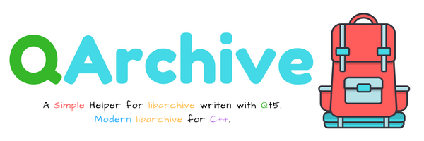

<p align="center">
    <br>
</p>


# QArchive [](https://github.com/antony-jr/QArchive/issues) [](https://github.com/antony-jr/QArchive/network) [](https://github.com/antony-jr/QArchive/stargazers) [](https://github.com/antony-jr/QArchive/blob/master/LICENSE) [](https://www.codacy.com/app/antony-jr/QArchive?utm_source=github.com&amp;utm_medium=referral&amp;utm_content=antony-jr/QArchive&amp;utm_campaign=Badge_Grade) 

For a **long time** I've been searching for a easy to use archive library for **C++** with **Qt** support , I came accross    
**libarchive** , it was super cool :heart: but it did'nt have a official **C++** binding. Some C++ Wrappers for libarchive exists    
like **moor** but I needed something so simple as **1,2,3 and also support Qt's event loop.**    

So **QArchive** is the result of the above :dog: , it is a C++ Cross-Platform header :ring: that Modernizes :rocket: libarchive using Qt5 :paintbrush: . Simply extracts 7z :hamburger: , Tarballs :8ball: , RAR :briefcase: and other supported formats by libarchive. :heart:.

**QArchive can be easily integrated into your project because its just a header file! it is also non-blocking so its best   
suited for your Qt Projects!**

**Depends on:** Qt5 Core Libraries and LibArchive.

# Usage

**Witness it with your own eye's**   

```
#include <QCoreApplication>
#include <QDebug>
#include "QArchive.hpp"

int main(int argc, char** argv)
{
    QCoreApplication app(argc, argv);
    QArchive::Extractor e("test.7z");
    QObject::connect(&e, &QArchive::Extractor::finished, [&]() {
        qDebug() << "Finished all extraction!";
        e.quit();
        app.quit();
    });
    e.start();
    return app.exec();
}

```

**Refer the wiki for more information ,** [QArchive Wiki](https://github.com/antony-jr/QArchive/wiki)


# Installation

Before jumping the guns make sure you have installed **libarchive** , refer libarchive repo at [LibArchive](https://github.com/libarchive/libarchive)

```
 $ git clone https://github.com/antony-jr/QArchive
 $ # Thats it
```

**Refer the wiki for more information on Compiling ,** [Compiling with QArchive](https://github.com/antony-jr/QArchive/wiki/Compiling)

# Deploying your apps

I really recommend you all to use dynamic linking on all platforms and then pack it with simple containers this way you can   
avoid the overhead of static compiling and also make it just work! :dog:

In windows you can simply throw in the dll files and compress it into a setup file and distribute it to the users but its   
different in linux , refer this [Qt Doc](http://doc.qt.io/qt-5/linux-deployment.html) for information on deploying qt apps.   

In addition you can use [AppImages](https://github.com/appImage/appimagekit) and [linuxdeployqt](https://github.com/probonopd/linuxdeployqt).

Take a look at [Example-x86_64.AppImage](https://github.com/antony-jr/QArchive/releases/download/v0.0.2/Example-x86_64.AppImage) , its a extractor that is built with Qt5 and libarchive which runs just like that.   

```
 $ chmod +x Example-x86_64.AppImage # to make it exec
 # ./Example-x86_64.AppImage -h
```
Now you must know the awesomeness of **AppImages**.

# Thank You 

I really need to thank the developers of this libraries for creating it because QArchive is elegant because of them! :heart:   

* [LibArchive](https://github.com/libarchive/libarchive)
* [AppImages](https://github.com/appImage/appimagekit)
* [Qt](https://github.com/qt)


# Support [](https://liberapay.com/antonyjr/donate) [](https://twitter.com/intent/tweet?text=Checkout%20%23QArchive%20by%20%40antonyjr0%20%20%2C%20its%20cool.%20Try%20it%20at%20https%3A%2F%2Fgithub.com%2Fantony-jr%2FQArchive)

If you think that this project is **cool** then you can give it a :star: or :fork_and_knife: it if you want to improve it with me. I really :heart: stars though!   

<p align="center">
    <a href="https://liberapay.com/antonyjr/donate">
       
    </a>
</p>


If you want to do something that stands out then you can click the **donate** button at the top to make a monthly donation , So   
I will make sure that I stay healthy and keep on to do my work. :briefcase: Supporting me means supporting all of my projects , So   
you are like **Tony Stark** :heart: who backs **Spider-Man**! Thank you for your extra care! :dog:   

You can also tweet about me on twitter , get connected with me [@antonyjr0](https://twitter.com/antonyjr0)

Thank You! :smiley_cat:

# License

The BSD 3-clause "New" or "Revised" License.

Copyright (C) 2017 , antony jr.   
All Rights Reserved.
